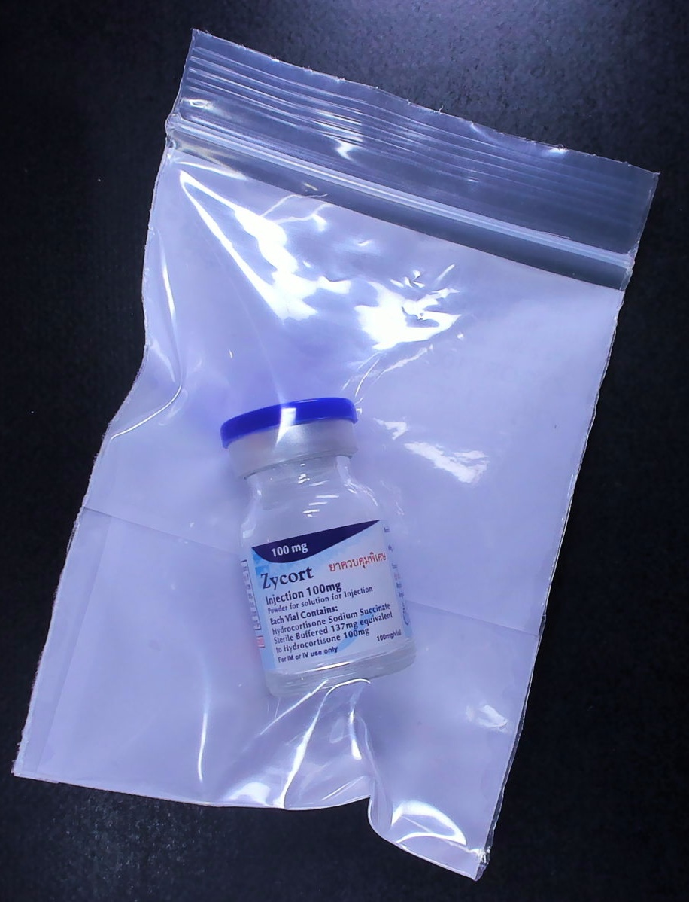

# Pill Identification System Showcase

| **Tablet** | **Capsule** | **Box** |
| :---: | :---: | :---: |
|  |  |  |
| **Blister** | **Ampoule** | **Vial** |
|  |  |  |

> **Portfolio Showcase**: This repository contains documentation for a project I developed during my employment. Therefore, source code is not available. This `README` serves as a high-level overview of the project, its key features, and my development role.

## Project Narrative & My Role

As the core developer on this project, I was tasked with building a comprehensive pill identification system from the ground up. The initial scope was to identify **tablets** and **capsules**, but the project was later expanded to include challenging identification of **medicine boxes**, **blisters**, **ampoules**, and **vials**.

I was responsible for the **end-to-end technical development of the core system**, from initial data collection and model training to full-stack web development and providing the necessary backend services for the mobile application.

My key contributions include:

*   **Full-Stack Development (Backend):** I developed the core pill identification engine and the backend of the web application.
*   **Full-Stack Development (Frontend):** I created a web-based frontend for debugging and testing the backend system.
*   **API & Mobile Integration:** I collaborated with the mobile developer to provide a WebSocket-based payload for the production mobile application.
*   **Dataset Creation:** I was responsible for collecting and preparing the image dataset of various medicines for training the machine learning model.
*   **System Design:** I designed the end-to-end workflow of the identification system.

This project was a significant opportunity for me to architect and build a complex AI application from concept to a functional prototype, which was demonstrated twice in public showcases.

## Tech Stack

*   **AI & Computer Vision:** Python, YOLO (Ultralytics), OpenCV
*   **Backend:** Django
*   **Frontend:** HTML, CSS, JavaScript, Tailwind CSS
*   **Databases & Caching:** SQLite, Redis

## Key Features

The system processes images to identify various forms of medicine in real-time, providing the following capabilities:

*   **Multi-Form Identification:** Identifies medicine in various forms including tablets, capsules, boxes, blisters, ampoules, and vials.
*   **Flexible Image Analysis:** The system is designed to process images at any orientation. For optimal accuracy with tablets and capsules, the items must not be stacked or overlapping.
*   **Robust Tablet Recognition:** Accurately identifies tablets even in challenging scenarios, such as when a package contains a non-uniform mix of pills (different sizes, colors, or shapes) or includes broken tablets.
*   **Fine-Grained Recognition:** Distinguishes between medicines with very similar visual appearances. For example, it can successfully differentiate between two types of ampoules in transparent bottles that both contain transparent liquid and feature similar green labels—a task that is challenging for the human eye.
*   **Standardized Identification:** Utilizes the **Thai Medicines Terminology (TMT)** number as a unique identifier, specifically focusing on the **Trade Product Unit (TPU)** category. This links every identification to a national standard, with data referenced from the official [TMT portal](https://tmt.this.or.th/).

## Showcase of Identification Capabilities

This section provides visual examples of the system's identification performance.

> **Note on Output:** The following results are shown as simplified JSON to represent the raw data extracted by the backend identification engine. This is not the final user-facing output.

---

### Standard Identification Examples

The system can successfully identify a wide range of medicine types from a single image.

| Input Image | System Output (JSON) |
| :--- | :--- |
|  | ```json { "form": "tablet", "tmt": "117222", "name": "BESTATIN 10", "shape": "oval", "color": "pink", "scoring": "single", "width": 14, "height": 9, "error": null }``` |
|  | ```json { "form": "capsule", "tmt": "786858", "name": "MAGORAL", "shape": "oblong", "color": "yellow-green", "scoring": "none", "width": 20, "height": 8, "error": null }``` |
|  | ```json { "form": "box", "tmt": "592601", "name": "BROVOL PIP" }``` |
|  | ```json { "form": "blister", "tmt": "1134347", "name": "BERLONTIN 100" }``` |
|  | ```json { "form": "ampoule", "tmt": "536245", "name": "ACETIN" }``` |
|  | ```json { "form": "vial", "tmt": "1264908", "name": "ZYCORT" }``` |

---

### Advanced & Challenging Scenarios

The following examples demonstrate the system's robustness in more complex situations.

#### 1. Identification of Broken Tablets

The system can correctly identify pills even when they are damaged or incomplete.

| Input Image | System Output (JSON) |
| :--- | :--- |
|  | ```json { "form": "tablet", "tmt": "129523", "name": "PONSTAN 500", "shape": "oval", "color": "yellow", "scoring": "none", "width": 20, "height": 10, "error": "Tablets 'Broken' are found" }``` |

#### 2. Differentiating by Size (Same Color and Shape)

The system can detect anomalies when a package contains pills that should be uniform but have different sizes.

| Input Image | System Output (JSON) |
| :--- | :--- |
|  | ```json { "form": "tablet", "tmt": "235234", "name": "ALLOPURINOL", "shape": "round", "color": "white", "scoring": "single", "width": 11, "height": 11, "error": "'Width' and 'Height' different are found" }``` |

#### 3. Differentiating by Color (Same Size and Shape)

Similarly, the system can distinguish between tablets based on color.

| Input Image | System Output (JSON) |
| :--- | :--- |
|  | ```json { "form": "tablet", "tmt": "907740", "name": "GPO-HCTZ", "shape": "round", "color": "yellow", "scoring": "+", "width": 8, "height": 8, "error": "'Color' different is found" }``` |

#### 4. Distinguishing Between Highly Similar Items

This showcases the fine-grained recognition capability, where the system tells apart items that look nearly identical.

| Input Image | System Output (JSON) |
| :--- | :--- |
|  | ```json { "form": "ampoule", "tmt": "120291", "name": "FENAC" }``` |
|  | ```json { "form": "ampoule", "tmt": "556126", "name": "DEXTON" }``` |
|  | ```json { "form": "box", "tmt": "952263", "name": "SARA (STRAWBERRY) 120" }``` |
|  | ```json { "form": "box", "tmt": "957539", "name": "SARA (STRAWBERRY) 250" }``` |